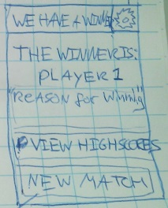

## Design Document Ghost App

Alex van der Meer

10400958

a.meerdervan@gmail.com

###Design deciscions

I added a pdf containing a class diagram of the app. This is visible in Figure 1. 

Figure 1. Class diagram of the Ghost App

All android activity's are represented by a class diagram, additional to these activity's there are three other classes. 
Next these other classes and their relevance are discussed per class. 

###The GameEngine class
The GameEngine class contains the dictionary. The dictionary is a large object and has to be read in to the app at launch time. If the dictionary would be in the game controlling activity, then when this activity closes and reopens the dictionary has to be initialized again. This happens when the game controlling activity would call on the screen that shows the winner(clossing the game activity) and then start a new game from there. To initialize this dictionary there is a FillDictionaryFromFile function. 
Now that the GameEngine class has the dictionary it is straightforward to also have it contain all functions that do operations on the dictonary. Therefore the class is called GameEngine, since it has al the tools to play the game in the sence of checking wheter a newly added letter makes the player win or lose, or just continue. This is done by the GameEndedAfterLetter function. This function should return a bool so that the GhostGameActivity class only needs to use a simple if statement to determine what to do after the input of a new letter. The ReasonForWinning attribute should be a string that is assigned by the GameEndeAfterLetter function. This attribute can than be passed to the WinnerScreenActiviy class for use of displaying on the screen.
What is not shown in the pdf is that all activity classes have a <<uses>> relationship with the GameEngine class.The GameEngine class has an atribute Language, every activity needs to know the current language to know in which language to display. 

###The Players and Player classes
This class contains all the information about players. Multiple activities need this information so it is bundled in a sepparate class. It has atrributes to identify the current players and the previous. 
The current players are used in the GhostGameActivity class to be able to display their names. The GhostSetupActivity needs the previous players so that it can put their names as a default/suggestion value in the textboxes. In this way the user does not have to retype the names after each game.
For more comfort for the user, all previously used player names displayed in these same boxes. The history of players can be accesed trough the PlayersArray atribute in the Players class. Here only the names of the players are required, however the GhostHighscoresActivity class needs both the names and the scores. To combine this the PlayersArray atribute combines player scores and names. This is done using objects of a Player class with atributes score and name. Now we will discuss the methods that the Players class needs. It needs to be able to add new players, hence the AddPlayer method. In the settings activity there is an option to remove all players hence the RemoveAllPlayers method. The app should remember its user history after closing, therefore there are two methods added, 1 that fills the class from a file and one that writes to a file. 
The last method to be discussed is the SortArrayOnHighscore method. The highscores page should display the highscores in order, this method takes care of this. 

###A description per activity class. 

In the activtity classes in the class diagram in the pdf most activities have little to no atributes. For the methods most are simply methods that handle button clicks and switch between screens. 
The other methods and the atributes that they need will be discusses hereafter. 

###GhostInitialSetupActivity
The first time that the user ever starts the app, the InitialSetupActivity will be shown. This screen lets the user view the rules and set the language or continue to the next screen. For the convienience of the user this is the last time this screen will be present while starting the app, since the user will probably not forget the rules and will not have changed his prefered language. The language information is stored in the GameEngine class. 
A sketch of this screen is visible in Figure 2. 

Figure 2. A sketch of the InitialSetupActivity screen

###GhostSetupActivity
The second screen (or later the first screen) after starting the app displays two edittexts where the name of player1 and player2 have to be filled in. However when the game is played before the privous player is visible in the textbox so that one can click continue imidiately. On clicking an edittext the history of player names will come out as a dropdown for convienience. 

Figure 3. A sketch of the GhostSetupActivity screen

###GhostGameActivity
This activity is used for both player1 and player2 to show the progress of the game, this yields faster rendering and less code. The users can enter a letter using an edittext input, the onClick method of a button that passes this user input checks if the input is only one letter. The class has an AddLetter method that takes adds the letter to the current WordFragment and runs the method of the GameEngine class to determine wheter the game ends or continues. To know whoose turn it is, the class has a CurrentPlayer atribute. Almost all other activities have a buttion to go to the settings screen, this one has a button to go to a pause screen. This was done, so that the user would be able to view the rules and start a new game while playing the game.

Figure 4. A sketch of the GhostGameActivity screen 

###GhostPauseActivity
Here the intro of the last section on this activity is expanded. The screen offers two options to start a new game. "Reset Match" is used to reset the match imediately with the same users, while "Change players" redirects the user to the screen before the game where player names can be selected. This is done to decrease the path of a user that wants to play a new game with the same users. From this screen the settings tab can also be opened. For the unlikely case that a user forgot the rules of the game while playing, their is a button "view rules" that opens the rules activity. 

Figure 5. A sketch of the GhostPauseActivity screen 

###WinnerScreenActivity
This class recieves the reason for winning and who won via putextra on the intent of the game activity. These are simply displayed on the screen using textviews. The screen has buttons to navigate to the highscores, or if the user is not interested, a button to start a new match. 

Figure 6. A sketch of the WinnerScreenActivity

###GhostSettingsActivity
This screen contains only 3 options. Set the language which is then altered in the GameEngine class so that all activities can exces this change. The second option is to clear all usernames, this of course also clears all highscores. The last option is to clear all highscores. Since all usernames and scores are stored in the Players class, this class is called. 

Figure 7. A sketch of the GhostSettingsActivity screen 
###GhostHighScoresActivity
On this screen is a list of highscores visible. First the Players class calls the sortbyHighscore method and then all players are listed. To start a new match from this screen there is a button added. 

Figure 8. A sketch of the GhostHighscores screen
###GhostRulesActivity
This screen simply displays the rules. These are stored in a string object of this class. 
However it does have the familiar settings button

Figure 9. A sketch of the GhostRulesActivity screen  

